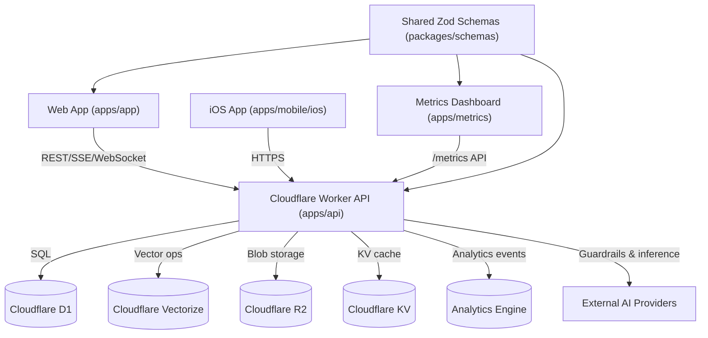

# Project Overview
Polychat is a Cloudflare-first AI platform monorepo that unifies a multi-provider API, a React web client, a metrics dashboard, and a native iOS app to deliver chat, agent, retrieval, and analytics workflows across dozens of foundation models.

## Repository Structure
- `apps/` – Deployable applications for the platform.
  - `apps/api/` – Cloudflare Worker API (Hono, Drizzle ORM, multi-provider orchestration).
  - `apps/app/` – React Router 7 web/PWA client with offline storage and WebLLM.
  - `apps/metrics/` – React analytics dashboard powered by Cloudflare Analytics Engine.
  - `apps/mobile/` – Native iOS client (Xcode project under `ios/`).
- `packages/` – Shared workspace packages.
  - `packages/schemas/` – Zod schemas shared between backend and frontends.
- `docs/` – Project imagery and media assets.
- `playwright-report/`, `test-results/`, `coverage/` – Generated test artifacts.
- `README.md`, `LICENSE` – Root documentation and licensing.
- `pnpm-workspace.yaml`, `pnpm-lock.yaml`, `vitest.workspace.ts` – Workspace configuration.
- `playwright.config.ts`, `vitest.config.ts`, `biome.json` – Global tooling configs.

## Build & Development Commands
- **Initial setup (once per clone)**
  ```sh
  pnpm install
  ```
- **Daily development**
  ```sh
  pnpm run dev              # API + frontend together (default workflow)
  pnpm run dev:api          # API worker only
  pnpm run dev:app          # React router dev server
  pnpm run dev:metrics      # Metrics dashboard
  pnpm dev:mobile           # Build iOS simulator target (requires Xcode)
  ```
- **Quality gates (run before pushing/PR)**
  ```sh
  pnpm run lint
  pnpm run typecheck
  pnpm run test
  ```
  Use `pnpm run format` or `pnpm run check` to auto-fix Biome issues when necessary.
- **Extended coverage / CI parity**
  ```sh
  pnpm run coverage         # Vitest coverage report
  pnpm run test:e2e         # Playwright end-to-end suite (slow)
  pnpm test:mobile          # XCTest for iOS client (very slow, only when touching native code)
  ```
- **Deployments (coordination required)**
  ```sh
  pnpm run deploy
  pnpm run deploy:api
  pnpm run deploy:app
  pnpm run deploy:metrics
  ```
- **Database (API)**
  ```sh
  cd apps/api && pnpm run db:generate      # scaffold new migration
  cd apps/api && pnpm run db:migrate:local # apply to local D1
  cd apps/api && pnpm run db:migrate:preview
  cd apps/api && pnpm run db:migrate:prod
  ```
- **Per-app schema refresh**
  ```sh
  cd apps/api && pnpm --filter @assistant/schemas build && wrangler dev src/index.ts
  cd apps/app && pnpm --filter @assistant/schemas build && react-router dev
  cd apps/metrics && pnpm --filter @assistant/schemas build && vite
  ```

## Code Style & Conventions
- TypeScript everywhere (`"type": "module"`) with shared configs in the workspace root; per-app `tsconfig*.json` extend these defaults.
- Biome (`biome.json`) enforces double quotes and space indentation. `pnpm run lint`/`pnpm run check` delegate to Biome; formatters should never touch generated artifacts.
- Testing is wired via `vitest.workspace.ts` and per-app `vitest.config.ts`; update app configs when changing environments.
- Playwright lives at `playwright.config.ts` (root) with global setup/teardown scripts for API bootstrapping.
- Frontend-specific runtime config (CSP, analytics, API endpoints) resides in `apps/app/src/constants.ts`.
- Use standard GitHub Flow: short-lived branches, descriptive commit messages, and PR descriptions that state intent plus testing done. No commit or PR template is enforced.

## Architecture Notes

- `apps/api` hosts a Hono-based worker that layers auth, rate limiting, guardrails, and provider routing; repositories encapsulate D1 access while services orchestrate chat, tools, search, and app-specific flows.
- Vector search (Cloudflare Vectorize) and AI providers sit behind `AIProviderFactory` and `ModelRouter`, enabling automatic model selection, cost tracking, and RAG operations.
- `apps/app` consumes the API through typed Zod schemas, manages local/offline state with IndexedDB/Zustand, and optionally swaps to WebLLM for offline inference.
- `apps/metrics` queries the API’s `/metrics` endpoint (Analytics Engine) for dashboards, while the iOS client mirrors frontend flows using the same REST contracts.
- Shared schema package keeps API contracts synchronized across all clients.

## Testing Strategy
- **Before you submit**
  - `pnpm run lint`
  - `pnpm run typecheck`
  - `pnpm run test`
  - Call out any new migrations, schema builds, snapshot updates, or iOS artifacts in the PR description.
- Unit tests run through `pnpm run test`; per-app configs live in `apps/*/vitest.config.ts` with coverage thresholds enforced by `pnpm run coverage`.
- Frontend and metrics suites use `jsdom` plus Testing Library setup files located under `src/test`.
- E2E workflow (`pnpm run test:e2e`) executes Playwright using root config and spins up the API via global setup; expect longer runtimes.
- Native/mobile verification is via `pnpm test:mobile` (`xcodebuild test`). Required when modifying Swift/Objective-C or Capacitor integrations.
- Database-affecting changes should be validated by applying migrations locally with `pnpm run db:migrate:local` before tests that touch persistence.
- **CI expectations**
  - `.github/workflows/test.yml` runs `pnpm check`, `pnpm --filter @assistant/schemas build`, `pnpm typecheck`, `pnpm test`, and `pnpm coverage` on every PR to `main`/`canary`/`*.x`.
  - `.github/workflows/scan.yml` executes TruffleHog secret scanning on every PR.
  - `.github/workflows/ios.yml` builds and tests the iOS app when files under `apps/mobile/ios` change.
  - Coverage summaries are posted as part of the GitHub Action; maintain existing thresholds (70% global in Vitest configs).

## Security & Compliance
- Secrets reside in `.dev.vars` (local) and Cloudflare `wrangler` bindings (`wrangler.jsonc`); never commit actual credentials.
- API enforces CORS/CSRF, security headers, hCaptcha, and Cloudflare rate limit bindings (`FREE_RATE_LIMITER`, `PRO_RATE_LIMITER`) before entering route handlers.
- Usage throttling is governed by `USAGE_CONFIG`; conversation, memory, and function calls are validated via Zod schemas and provider caps.
- Frontend sets an explicit CSP (`apps/app/src/constants.ts`) and injects CSRF tokens through the fetch wrapper; analytics toggles are feature-flagged.
- Guardrails integrate with Llamaguard, AWS Bedrock guardrails, and custom monitoring hooks to log violations to Analytics Engine.
- `.github/workflows/scan.yml` runs TruffleHog secret scanning on every PR; address any findings before merging. Dependency/SBOM tooling is not yet configured.
- Repository is licensed under Apache-2.0 (`LICENSE`).

## Agent Guardrails
- Never edit generated or vendored artifacts (`node_modules/`, `dist/`, `build/`, `coverage/`, `playwright-report/`, `test-results/`) except via their build scripts.
- Avoid touching `pnpm-lock.yaml`, `wrangler.jsonc`, or Cloudflare binding blocks without maintainer approval; these files carry secrets and environment bindings.
- Treat database migrations (`apps/api/migrations/`) as generated assets—create via Drizzle commands, avoid manual edits, and pair with schema/test updates.
- `apps/mobile/ios` is Xcode-managed; safe edits include Swift/Objective-C source, localized strings, or documentation. Unsafe edits include manual `.xcodeproj` tweaks, provisioning changes, or derived data.
- Preserve shared schema contract (`packages/schemas/src`); when editing, rebuild with `pnpm --filter @assistant/schemas build` and notify dependent app owners.
- Leave `.dev.vars`, `.wrangler`, and other secret-bearing files untouched; never log, copy, or print credentials.
- Respect rate-limited external APIs—batch requests and honor provider quotas to avoid account suspension.

## Extensibility Hooks
- Extend routing or domain logic within `apps/api/src/services/**` and `apps/api/src/routes/**`; repositories centralize D1 access for reuse.
- Customize model routing heuristics in `apps/api/src/lib/modelRouter` or adjust usage policies via `USAGE_CONFIG` if required for new models.
- Add dynamic tools/apps under `apps/api/src/routes/apps` with supporting services, and expose new schemas in `packages/schemas`.
- Frontend pages follow React Router file-conventions under `apps/app/src/pages`; shared state lives in `state/stores` (Zustand) and `lib/api` services.
- Feature toggles and env flags (`ALWAYS_ENABLED_PROVIDERS`, `VITE_*`, `OLLAMA_ENABLED`, beacon analytics) provide runtime configurability without code changes.

## Further Reading
- [README.md](README.md)
- [apps/api/README.md](apps/api/README.md)
- [apps/app/README.md](apps/app/README.md)
- [apps/metrics/README.md](apps/metrics/README.md)
- [apps/mobile/ios/README.md](apps/mobile/ios/README.md)
- [apps/api/AGENTS.md](apps/api/AGENTS.md)
- [apps/app/AGENTS.md](apps/app/AGENTS.md)
- [apps/metrics/AGENTS.md](apps/metrics/AGENTS.md)
- [packages/schemas/AGENTS.md](packages/schemas/AGENTS.md)
- [apps/mobile/ios/AGENTS.md](apps/mobile/ios/AGENTS.md)
