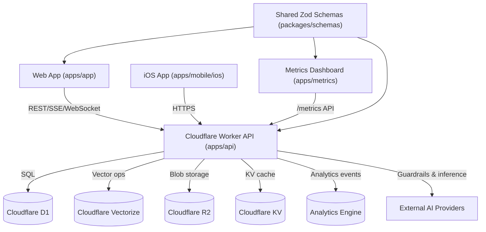

# Project Overview
Polychat is a Cloudflare-first AI platform monorepo that unifies a multi-provider API, a React web client, a metrics dashboard, and a native iOS app to deliver chat, agent, retrieval, and analytics workflows across dozens of foundation models.

## Repository Structure
- `apps/` – Deployable applications for the platform.
  - `apps/api/` – Cloudflare Worker API (Hono, Drizzle ORM, multi-provider orchestration).
  - `apps/app/` – React Router 7 web/PWA client with offline storage and WebLLM.
  - `apps/metrics/` – React analytics dashboard powered by Cloudflare Analytics Engine.
  - `apps/mobile/` – Native iOS client (Xcode project under `ios/`).
- `packages/` – Shared workspace packages.
  - `packages/schemas/` – Zod schemas shared between backend and frontends.
- `docs/` – Project imagery and media assets.
- `playwright-report/`, `test-results/`, `coverage/` – Generated test artifacts.
- `README.md`, `LICENSE` – Root documentation and licensing.
- `pnpm-workspace.yaml`, `pnpm-lock.yaml`, `vitest.workspace.ts` – Workspace configuration.
- `playwright.config.ts`, `vitest.config.ts`, `biome.json` – Global tooling configs.

## Build & Development Commands
```sh
pnpm install
```
```sh
pnpm run dev
pnpm run dev:api
pnpm run dev:app
pnpm run dev:metrics
pnpm dev:mobile
```
```sh
pnpm run lint
pnpm run format
pnpm run check
pnpm run typecheck
```
```sh
pnpm run test
pnpm run coverage
pnpm run test:e2e
pnpm test:mobile
```
```sh
pnpm run deploy
pnpm run deploy:api
pnpm run deploy:app
pnpm run deploy:metrics
```
```sh
cd apps/api && pnpm run db:generate
cd apps/api && pnpm run db:migrate:local
cd apps/api && pnpm run db:migrate:preview
cd apps/api && pnpm run db:migrate:prod
```
```sh
cd apps/api && pnpm --filter @assistant/schemas build && wrangler dev src/index.ts
cd apps/app && pnpm --filter @assistant/schemas build && react-router dev
cd apps/metrics && pnpm --filter @assistant/schemas build && vite
```

## Code Style & Conventions
- TypeScript everywhere
- Biome (`biome.json`) formats code with spaces and double quotes; linting invoked via `pnpm run lint/check`.
- Vitest handles unit tests; Playwright covers E2E; and generates coverage reports.

## Architecture Notes

- `apps/api` hosts a Hono-based worker that layers auth, rate limiting, guardrails, and provider routing; repositories encapsulate D1 access while services orchestrate chat, tools, search, and app-specific flows.
- Vector search (Cloudflare Vectorize) and AI providers sit behind `AIProviderFactory` and `ModelRouter`, enabling automatic model selection, cost tracking, and RAG operations.
- `apps/app` consumes the API through typed Zod schemas, manages local/offline state with IndexedDB/Zustand, and optionally swaps to WebLLM for offline inference.
- `apps/metrics` queries the API’s `/metrics` endpoint (Analytics Engine) for dashboards, while the iOS client mirrors frontend flows using the same REST contracts.
- Shared schema package keeps API contracts synchronized across all clients.

## Testing Strategy
- Run workspace unit tests with `pnpm run test`; Vitest configs live per app (`apps/*/vitest.config.ts`) with coverage thresholds enforced via `pnpm run coverage`.
- Frontend and metrics apps use `jsdom` environments plus Testing Library setups under `src/test`.
- E2E suite (`pnpm run test:e2e`) uses Playwright; global setup migrates the local D1 database and boots the API worker before exercising `apps/app` flows.
- Mobile CI/dev tests rely on `pnpm test:mobile`, which invokes `xcodebuild test`.
- Database migrations should be applied locally via `pnpm run db:migrate:local` before running API tests that touch persistence.

## Security & Compliance
- Secrets reside in `.dev.vars` (local) and Cloudflare `wrangler` bindings (`wrangler.jsonc`); never commit actual credentials.
- API enforces CORS/CSRF, security headers, hCaptcha, and Cloudflare rate limit bindings (`FREE_RATE_LIMITER`, `PRO_RATE_LIMITER`) before entering route handlers.
- Usage throttling is governed by `USAGE_CONFIG`; conversation, memory, and function calls are validated via Zod schemas and provider caps.
- Frontend sets an explicit CSP (`apps/app/src/constants.ts`) and injects CSRF tokens through the fetch wrapper; analytics toggles are feature-flagged.
- Guardrails integrate with Llamaguard, AWS Bedrock guardrails, and custom monitoring hooks to log violations to Analytics Engine.
- Dependency scanning, SBOM, and secret scanning practices are not defined.  
- Repository is licensed under Apache-2.0 (`LICENSE`).

## Agent Guardrails
- Never edit generated or vendored artifacts (`node_modules/`, `dist/`, `build/`, `coverage/`, `playwright-report/`, `test-results/`) except through build commands.
- Avoid touching `pnpm-lock.yaml`, `wrangler.jsonc`, or Cloudflare binding blocks without human review; changes can break deployments and secrets.
- Treat database migrations (`apps/api/migrations/`) as automated: generated with Drizzle, do not hand-edit.
- `apps/mobile/ios` is Xcode-managed; restrict automated edits to documentation or clearly scoped Swift/Obj-C changes.
- Preserve shared schema contract (`packages/schemas/src`) when updating endpoints; regenerate builds via `pnpm --filter @assistant/schemas build`.
- Leave `.dev.vars` and other secret files untouched; never log or publish credentials.
- Respect rate-limited external APIs—batch operations should consider provider quotas.

## Extensibility Hooks
- Extend routing or domain logic within `apps/api/src/services/**` and `apps/api/src/routes/**`; repositories centralize D1 access for reuse.
- Customize model routing heuristics in `apps/api/src/lib/modelRouter` or adjust usage policies via `USAGE_CONFIG` if required for new models.
- Add dynamic tools/apps under `apps/api/src/routes/apps` with supporting services, and expose new schemas in `packages/schemas`.
- Frontend pages follow React Router file-conventions under `apps/app/src/pages`; shared state lives in `state/stores` (Zustand) and `lib/api` services.
- Feature toggles and env flags (`ALWAYS_ENABLED_PROVIDERS`, `VITE_*`, `OLLAMA_ENABLED`, beacon analytics) provide runtime configurability without code changes.

## Further Reading
- [README.md](README.md)
- [apps/api/README.md](apps/api/README.md)
- [apps/app/README.md](apps/app/README.md)
- [apps/metrics/README.md](apps/metrics/README.md)
- [apps/mobile/ios/README.md](apps/mobile/ios/README.md)
