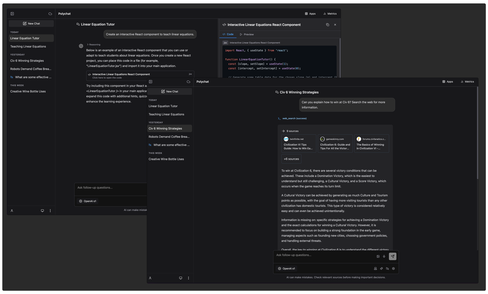

# Polychat AI Platform

Polychat is an experimental multi-model AI assistant platform. It brings chat, agents, retrieval, generated media, code assistance, and workflow-style apps into one Cloudflare-backed API with React web and iOS clients (In Development).

Check out my write up on this project [here](https://nicholasgriffin.dev/blog/building-my-own-ai-assistant). I've also launched a version of this to try out at [polychat.app](https://polychat.app).

> [!NOTE]
> Please note that this project is still in active development so there are a few features that are not yet fully working or fully imagined. I'm also constantly testing stuff and re working, this is meant to be a playground for me.



## Quick Links

- **API Documentation** - Live OpenAPI schema at [api.polychat.app/openapi](https://api.polychat.app/openapi) (served from `apps/api/src/index.ts`, with tags in `apps/api/src/openapi/documentation.ts`)
- **[Example Chats](#example-chats)** - See what's possible
- **[Getting Started](#setup-and-installation)** - Set up your own instance
- **[Features](#features)** - What's included

## Example Chats

Here are some example chats that you can try out:

- [Generation of a new React component](https://polychat.app/s/d27e1e2a-3ddf-495c-9b4f-d6866786f945)
- [Code generation and execution](https://polychat.app/s/51fb196d-7def-4922-94d8-08e7ee86989d)
- [Web search integration](https://polychat.app/s/aa7f6433-fdf8-4a56-bbe8-83fcf5715354)
- [Perplexity Deep Research](https://polychat.app/s/643fcf03-6849-4cbf-8643-abf93660e6dc)
- [Combined artifact previews](https://polychat.app/s/b2137aac-bea5-4dbe-912b-e5ca107cbeca)
- [Markdown formatting](https://polychat.app/s/0ccff6c7-7b62-4936-b18a-c05a098ef7e1)
- [Search Grounding](https://polychat.app/s/0ecf12e1-3ed4-494c-b41d-c60a235df7de)
- [Multi-model responses](https://polychat.app/s/3690158a-33b4-47bf-b831-97834299d71b)
- [Saved memories (RAG)](https://polychat.app/s/1e9a8f6e-e6dc-40a7-b24f-53fb8f4c6766)
- [Retrieved memories (RAG)](https://polychat.app/s/93552889-b3ec-445c-b72b-8d05f5b6117f)
- [Multi Step Tool Calls](https://polychat.app/s/9265e7d7-35e5-438e-b76c-576d12c2f770)
- [Multi Step MCP Calls](https://polychat.app/s/b8e6450f-3a26-4ec8-9c7a-07efd85f88e3)
- [Agent to agent delegation](https://polychat.app/s/d325a0e8-f2ef-4bf4-8425-a7d614f1d399)
- [Image Generation](https://polychat.app/s/f413fa60-6343-4591-93ff-9314b43e40cb)
- [Council](https://polychat.app/s/40ed0b48-1f9c-4290-b57f-4b214dd6ce3a)

## What's Included

This monorepo contains:

- **[API](./apps/api)** - OpenAI-style API for chat, agents, models, tools, memories, media, realtime sessions, payments, and webhooks
- **[Web App](./apps/app)** - React-based PWA frontend for chat, shared conversations, generated artefacts, and focused app workflows
- **[Sandbox Worker](./apps/sandbox-worker)** - Automated coding worker built on Cloudflare Sandboxes
- **[Metrics Dashboard](./apps/metrics)** - Usage analytics and monitoring
- **[Fine-tuning Toolkit](./apps/finetune)** - CLI for fine-tuning models via AWS Bedrock
- **[Mobile App](./apps/mobile/ios)** - iOS application (In Development) ([TestFlight](https://testflight.apple.com/join/52xrwxRP))

## Features

### Core API Features

- **Chat Completions** - OpenAI-style chat with streaming, tools, multimodal message parts, stored conversations, sharing, feedback, and token counting (tag: `chat`)
- **Multi-provider Model Library** - Anthropic, OpenAI, Google, Mistral, Meta, Bedrock, Groq, DeepSeek, Perplexity, Replicate, xAI, and many more through the provider registry (tag: `models`)
- **Code Assistance** - FIM completions, next-edit suggestions, apply-edit support, and sandboxed implementation workflows (tag: `code`)
- **Agents & Delegation** - Custom agents, shared agents, MCP server integrations, agent-to-agent delegation, and approval-aware tool flows (tag: `agents`)
- **RAG & Memories** - Vector-based context retrieval, memory groups, synthesis tasks, and namespace-aware retrieval with Cloudflare Vectorize (tag: `memories`)
- **Tools & Dynamic Apps** - Searchable function tools, dynamic app execution, reusable app responses, and app sharing (tags: `tools`, `dynamic-apps`, `apps`)
- **Media & Realtime** - Uploads, audio transcription and speech, image/video/music generation, screenshots, OCR, and realtime transcription sessions (tags: `uploads`, `audio`, `realtime`)
- **Guardrails & Auth** - Content safety checks, OAuth, magic links, passkeys, JWT, API keys, plan checks, Stripe subscriptions, rate limiting, CSRF, and security headers (tags: `guardrails`, `auth`, `plans`, `stripe`)

### Web App Highlights

- **[Automated Model Routing](https://nicholasgriffin.dev/blog/building-a-first-party-prompt-router)** - Smart model selection
- **AI Council** - Multi-perspective debate mode with selectable council members and synthesis
- **Canvas** - Multi-model image and video generation with shared prompt controls
- **Replicate App** - Run media and multimodal predictions from Replicate models
- **Sandbox App** - Connect GitHub repositories and stream implementation, review, test, or bug-fix runs
- **Strudel Music Patterns** - Generate and edit code-based music patterns
- **Podcast, Article, and Note Workflows** - Transcribe, summarise, report, format, and regenerate content
- **Drawing Apps** - Create drawings and ask AI to enhance or guess them
- **Web LLM Support** - Local/offline chat mode in the web app
- **Metrics Dashboard** - Usage, model performance, costs, and user activity monitoring

### Automated Coding with Sandbox Worker

The [Sandbox Worker](./apps/sandbox-worker) uses Cloudflare Sandboxes to run AI-powered code generation tasks against GitHub repositories. This enables automated feature implementation triggered via GitHub comments or the web UI.

**How it works:**

1. Install the GitHub App on your repository
2. Start an implementation, review, test, or bug-fix run from the web UI or GitHub workflow
3. The AI generates a plan and executes commands in an isolated sandbox
4. Progress streams back to the app while results are prepared for review

**Key capabilities:**

- Isolated command execution with security restrictions
- Real-time progress streaming via SSE
- Git operations (clone, branch, commit)
- Web UI for installation, run history, instructions, pausing, cancellation, and task tracking

**See all features in the OpenAPI reference → [api.polychat.app/openapi](https://api.polychat.app/openapi)**

## Usage Limits

Polychat is configured with usage limits to prevent abuse. These limits are as follows:

- 10 standard messages per day for unauthenticated users
- 50 standard messages per day for authenticated users
- 200 pro tokens per day for authenticated users

Pro tokens are calculated based on a multiplier of the cost of the model. For example, if a model costs $0.01 per 1000 input tokens and $0.05 per 1000 output tokens, then the pro token limit is 200 \* (0.01 + 0.05) / 2 = 6.

This equates to around:

- Expensive models (9x): ~22 messages
- Mid-tier models (3x): ~66 messages
- Cheaper models (1-2x): 100-200 messages

If you are providing your own service and would like to change these limits, you can do so by changing the `USAGE_CONFIG` object in the `apps/api/src/constants/app.ts` file.

## Setup and Installation

### Getting Started

1. Clone the repository
2. Install dependencies

   ```bash
   pnpm install
   ```

3. Configure environment variables:
   - Copy `.dev.vars.example` to `.dev.vars` in all the apps directories that have them.
   - Copy `wrangler.jsonc.example` to `wrangler.jsonc` in all the apps directories that have them.
   - Adjust with your API keys and configuration values.

4. Start the development servers:

   ```bash
   # Start the API and web app
   pnpm run dev

   # Or start individual apps
   pnpm run dev:app
   pnpm run dev:api
   pnpm run dev:metrics
   ```

### Deployment

The applications are designed to be deployed to Cloudflare:

```bash
# Deploy all applications
pnpm run deploy

# Deploy individual applications
pnpm run deploy:app
pnpm run deploy:api
pnpm run deploy:metrics
```

## API Documentation

The complete API documentation is generated by the API worker and served at [api.polychat.app](https://api.polychat.app). Route registration lives in `apps/api/src/index.ts`, with tag descriptions in `apps/api/src/openapi/documentation.ts`.

### Quick Example

```bash
curl https://api.polychat.app/chat/completions \
  -H "Authorization: Bearer YOUR_TOKEN" \
  -H "Content-Type: application/json" \
  -d '{
    "model": "claude-3-5-sonnet-20241022",
    "messages": [
      {"role": "user", "content": "Hello!"}
    ]
  }'
```

**View full API reference → [api.polychat.app](https://api.polychat.app)**

## Database Management

The application uses a Cloudflare D1 database with Drizzle ORM for schema management and migrations.

### Running Migrations

```bash
cd apps/api
# Migrate to the local database
pnpm run db:migrate:local

# Migrate to the preview database
pnpm run db:migrate:preview

# Migrate to the production database
pnpm run db:migrate:prod
```

To generate a new migration, run:

```bash
pnpm run db:generate
```

## Monitoring and Analytics

The metrics application provides dashboards for monitoring:

- API usage and performance
- Model performance and costs
- User activity and engagement

Access the metrics dashboard at [metrics.polychat.app](https://metrics.polychat.app).

## Contributing

Contributions are welcome! Please feel free to submit a Pull Request.

## License

This project is licensed under the terms of the license included in the repository.
