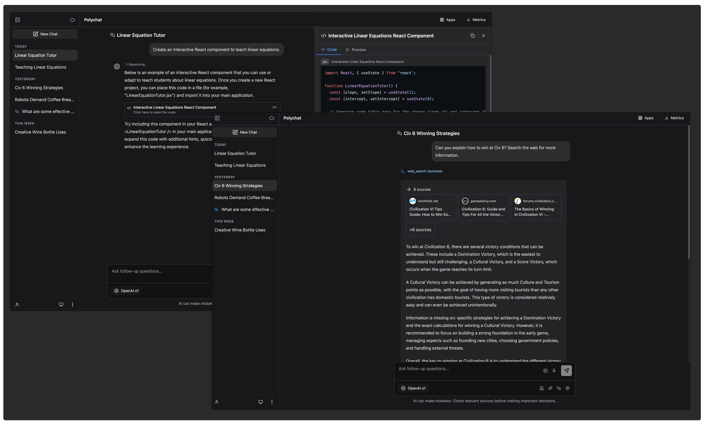

# Polychat AI Platform

Polychat is a multi-model AI assistant platform. It brings personal chat, collaborative project work, agents, retrieval, generated media, code assistance, and reusable workflows into one Cloudflare-backed API with web and iOS clients.

Try the hosted version at [polychat.app](https://polychat.app), or read [Building my own AI assistant](https://nicholasgriffin.dev/blog/building-my-own-ai-assistant) for the story behind the project.

> [!NOTE]
> Polychat is always in active development. Some features are still being developed, tested, or reimagined.

## Set up or adapt Polychat

Use the repo-local [`$polychat-setup`](./.agents/skills/polychat-setup/SKILL.md) skill with your coding agent. It will explain the product and its architecture, help you choose the capabilities you need, make the agreed configuration or white-labelling changes, and validate the result.

For example, ask your agent:

> Use `$polychat-setup` to help me run a white-labelled Polychat instance. Start with the web app and API, explain each decision, and make the changes after I confirm them.

## Product

Polychat has two primary modes:

- **Chat** is a personal, conversation-first space for models, agents, connected tools, memories, and installed recipes.
- **Work** organises collaborative work into workspaces and projects with shared instructions, conversations, sources, outputs, and selected capabilities.

The platform includes:

- Multi-provider chat with streaming, multimodal messages, model routing, sharing, feedback, and conversation compaction.
- Custom agents, MCP servers, delegation, approval-aware tools, and reusable workflows.
- Retrieval, memories, web research, generated media, realtime audio, and interactive artefacts.
- Project-scoped experiences for longer workflows such as notes, podcasts, media generation, and model training.
- Isolated coding runs against GitHub repositories through Cloudflare Sandboxes.
- Authentication, guardrails, subscriptions, rate limiting, audit history, and observability.

## Repository

- `apps/app` — React Router web application and PWA.
- `apps/api` — public Hono API Worker and platform control plane.
- `apps/sandbox-worker` — isolated coding-task execution Worker.
- `apps/training` — provider-backed model training and deployment Worker.
- `apps/mobile/ios` — native iOS client under active development.
- `packages/*` — shared schemas, utilities, runtime libraries, and reusable React components published under the `@ngriffin_uk/polychat-*` scope.

## Resources

### Examples

- [Generation of a new React component](https://polychat.app/s/d27e1e2a-3ddf-495c-9b4f-d6866786f945)
- [Code generation and execution](https://polychat.app/s/51fb196d-7def-4922-94d8-08e7ee86989d)
- [Web search integration](https://polychat.app/s/aa7f6433-fdf8-4a56-bbe8-83fcf5715354)
- [Perplexity Deep Research](https://polychat.app/s/643fcf03-6849-4cbf-8643-abf93660e6dc)
- [Interactive inline artifacts](https://polychat.app/s/64bc904c-20c3-4ccf-88bc-dbfe9c7df12c)
- [Document generation and collaboration through artifacts](https://polychat.app/s/16bbc46a-79fd-419c-a755-db14f303ced4)
- [Combined artifact previews](https://polychat.app/s/b2137aac-bea5-4dbe-912b-e5ca107cbeca)
- [Markdown formatting](https://polychat.app/s/0ccff6c7-7b62-4936-b18a-c05a098ef7e1)
- [Search Grounding](https://polychat.app/s/0ecf12e1-3ed4-494c-b41d-c60a235df7de)
- [Multi-model responses](https://polychat.app/s/3690158a-33b4-47bf-b831-97834299d71b)
- [Saved memories (RAG)](https://polychat.app/s/1e9a8f6e-e6dc-40a7-b24f-53fb8f4c6766)
- [Retrieved memories (RAG)](https://polychat.app/s/93552889-b3ec-445c-b72b-8d05f5b6117f)
- [Multi Step Tool Calls](https://polychat.app/s/9265e7d7-35e5-438e-b76c-576d12c2f770)
- [Multi Step MCP Calls](https://polychat.app/s/b8e6450f-3a26-4ec8-9c7a-07efd85f88e3)
- [Agent to agent delegation](https://polychat.app/s/d325a0e8-f2ef-4bf4-8425-a7d614f1d399)
- [Image Generation](https://polychat.app/s/f413fa60-6343-4591-93ff-9314b43e40cb)
- [Council](https://polychat.app/s/40ed0b48-1f9c-4290-b57f-4b214dd6ce3a)

### References

- [Live API reference](https://api.polychat.app/openapi)
- [Polychat setup skill](./.agents/skills/polychat-setup/SKILL.md)
- [Hosted Polychat](https://polychat.app)
- [Automated model routing](https://nicholasgriffin.dev/blog/building-a-first-party-prompt-router)
- [Multi-model image and video generation](https://nicholasgriffin.dev/blog/building-multi-model-image-and-video-generation-in-polychat)
- [Cloud AI coding environment](https://nicholasgriffin.dev/blog/building-my-own-cloud-ai-environment-with-cloudflare-containers/)
- [Contributing](./.github/CONTRIBUTING.md)
- [Licence](./LICENSE)
