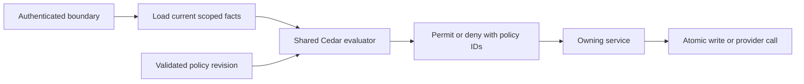

# Polychat policy

Keep access decisions consistent as Polychat adds new hosts and capabilities. Use the official Cedar engine through this package, with facts loaded by the owning service at each I/O boundary.

## Decide access

```ts
import { authorise } from "@ngriffin_uk/polychat-library-policy";

const decision = authorise("resource.write", {
  actorId: String(user.id),
  ownerId: String(output.created_by_user_id),
  scope: "project",
  member: true,
  role: membership.role,
});

if (!decision.allowed) {
  throw forbidden();
}
```

Load membership and scope from authoritative storage before constructing this context. Do not take these facts from request bodies, model input or client permission hints. Keep restrictive tenant queries, signatures, lease fences and atomic grant consumption around the decision.

Use `ownsResource`, `hasProEntitlement` and `operationIsGranted` for their common boundaries. Ownership keeps strict identifier types: numeric `7` and string `"7"` do not grant each other access.

## Add a policy

Add a typed context shape in `src/authorisation.ts` and a Cedar statement in the owning `src/policies` module. Context types derive from the same shapes used to build the Cedar schema. Call the shared evaluator from the owning service and protect the relevant denial, revocation or approval behaviour with a test.

Use `createAuthorizer({ id, schema, policies })` for a domain with its own policy schema. It accepts official Cedar policy sets, including linked templates. `namedPolicies` splits code-defined statements into stable diagnostic IDs and requires templates to be supplied explicitly.

## Deny errors

Validate policy bundles before use. Validate requests on every evaluation and deny requests with parsing, schema or evaluation errors, including an evaluation that also finds a matching permit. Return named policy IDs for domain-specific explanations without logging the request context or credentials.

## Run on supported hosts

Node uses the official Node adapter. Workers select the `workerd` export and statically import the official compiled WebAssembly module; `build:runtime` copies that asset into `dist`. Initialise lazily and preparse the fixed authorisation bundle once per isolate.

Keep changing tenant policies out of the engine's permanent preparse cache. Model governance bounds its own immutable authorizer cache to 100 entries. Keep the engine out of browser bundles and render server decisions in clients.

## Keep the application's boundaries

Put runtime integration, typed request contexts and code-defined authorisation policies in `packages/library-policy`. Keep model governance's subject mapping, revision storage, approval workflow and explanations in `library-model-registry` and the API's model modules. Keep routes responsible for validation and composition.



The built-in evaluator uses `Polychat::Actor`, `Polychat::Action` and `Polychat::Resource`. Existing services provide trusted identity and scope attributes in typed action contexts. These contexts describe the facts used by current boundaries rather than inventing a parallel entity store or permission database.

## Policy inventory

| Area                            | Cedar decision                                                                                          | Owning boundary                                                        |
| ------------------------------- | ------------------------------------------------------------------------------------------------------- | ---------------------------------------------------------------------- |
| Workspace and project access    | Pro entitlement, current membership and permitted roles                                                 | Workspace access services and conversation repository                  |
| Membership administration       | Owner/admin management of members and administrators                                                    | Workspace member mutations and invitation visibility                   |
| Personal resources              | Strict owner identity                                                                                   | Conversation, run, app, connection, upload, source and output services |
| Shared resources                | Member reads, owner/admin writes, author-owned member writes                                            | Output, source, collection and template access                         |
| Public sharing                  | Personal-only sharing and explicit public state                                                         | Conversation sharing service                                           |
| Teammates                       | Personal ownership, workspace roles and immutable platform teammates                                    | Teammate access and workspace defaults                                 |
| Capabilities                    | Explicit grants, exclusions and management authority                                                    | Capability resolver and workspace capability mutations                 |
| Tools and approval modes        | Entitlement, denied tools, mode permissions, human approval, effect classes and teammate autonomy level | Shared `PermissionChecker`                                             |
| Model execution                 | Active state, subscription/free/BYOK/device eligibility and credential source                           | Shared model resolver                                                  |
| Model governance                | Cedar predicates over version, evidence, route and dataset facts                                        | Registry evaluation, enforcement, previews and dry runs                |
| Model permissions and approvals | Action grants, independent approver, exact revision coverage, expiry and exceptions                     | Model access, decision and standing services                           |
| Model spend and promotion       | Budget hard stops, approval thresholds, warning states and alias approval gates                         | Budget preflight, deployment/training admission and aliases            |
| Delegation and execution        | Initiator, conversation access, attempt, cancellation and running state                                 | Delegation controls and run effect authority                           |
| Connector replay                | Bound owner/session/scope/operation, current connection revision and live grant state                   | Connector approval and replay services                                 |
| Sandbox credentials             | Granted operation, exact write refs and delivery target                                                 | Credential broker                                                      |
| Sandbox execution and network   | Command classifications, trust mode, read-only restrictions, host allowlist and attached tools          | Sandbox command authority and shared outbound gateway                  |
| Browser and computer use        | Creator/scope binding and takeover-sensitive input                                                      | Browser session authority and teammate computer policy                 |
| Platform services               | Admin role and authenticated service scopes                                                             | HTTP middleware                                                        |
| Memory                          | Subscription, sign-in, configured storage and user consent                                              | Chat memory boundary                                                   |

Some checks remain mechanisms around authorisation. **Keep authentication proofs, URL and shell parsing, secret redaction, tenant filters, accounting reservations, atomic approval consumption and lease fencing in their owning implementation.** Cedar evaluates their resulting facts but cannot replace their cryptography or concurrency guarantees.

Keep desktop third-party CLI permission flags and OS permissions as provider configuration. Client role displays and disabled controls are presentation hints; the server re-evaluates authority before access. Native desktop endpoint transport safety currently remains in the native host, separate from server permissions.

## Maintain the rules

Add an action context and its Cedar policy together. Extend existing domain policy modules, reuse common actions where their semantics match, and pass only authoritative values. Avoid one-off permission branches and generic API utility directories.

Treat **unknown actions and invalid facts as denied**. Cedar's normal semantics deny without a permit and let a matching forbid override permits. The wrapper also denies any evaluation diagnostic errors, so a broken predicate cannot silently disappear beside a successful permit.

Return stable policy IDs for explanations. Keep domain text in its owning package rather than putting human-facing messages into the engine. Do not log raw contexts, tokens or credentials.

## Store governance as Cedar

Keep the existing revisioned policy JSON contract and append-only revision/audit tables. A rule retains its ID, description and `allow`, `warn`, `review` or `block` outcome; its condition is now native Cedar source:

```json
{
  "id": "remote-code",
  "effect": "review",
  "description": "Review repository code before loading this version",
  "when": {
    "type": "cedar",
    "metadataOnly": true,
    "source": "permit(principal, action == Polychat::Action::\"governance.match\", resource) when { context.remoteCode };"
  }
}
```

Each governance statement matches an issue; the existing outcome metadata decides its workflow. Combine outcomes by severity so a project rule can narrow workspace rules. A `permit` in this matching schema identifies an issue and does not itself authorise model execution; `model.use` requires readiness, current approval coverage and absence of revocation.

Validate source against `GOVERNANCE_SCHEMA` before saving or previewing. Expose version kind/source/licence/formats, remote code, gating, parameter count, evidence kind/status pairs, route location/retention/verification and dataset lawful basis/customer-data facts. Keep missing values explicit through presence flags and documented sentinel values.

Set `metadataOnly` only for rules whose facts are available before inspection. Evidence-dependent rules should run after inspection. The policy editor edits source and outcome directly and uses the API's existing preview/save paths for engine validation.

## Preserve existing data

Translate legacy typed conditions into Cedar at the compatibility boundary. Evaluate them with the same official engine; do not maintain a second condition interpreter. Return native rules when reading old policies and persist native rules on their next save.

Retain existing stored hashes and revision numbers when reading older policies. Hash the normalised native rules for new revisions. No database migration or bulk remote write is required for this conversion.

Bind approval coverage to **scope, policy hash and rule ID**. Require an unexpired exception for a block and reject coverage of evaluator failures. A changed policy hash reopens approval even when it uses the same rule ID; this deliberately tightens the earlier scope-and-ID rule in ADR 0064.

## Handle runtime and cost

Use the official `@cedar-policy/cedar-wasm` engine for Node and Workers. Statically bundle its WebAssembly asset for Workers, initialise on first evaluation, and preparse only the fixed authorisation bundle. Cache tenant policy authorizers by immutable source with a bounded cache rather than accumulating engine preparse entries.

Cedar's integer type does not represent fractional currency. Keep exact existing cost calculations and comparisons in the budget domain and pass threshold facts into Cedar, avoiding silent currency rounding. Invalid or non-finite budget amounts fail closed.

Expect additional Worker bundle size and first-use CPU from WebAssembly initialisation and schema validation. Local production bundling and real Worker evaluation protect compatibility; assess production cold-start and CPU behaviour during the normal release process. Keep the engine out of web bundles and expose server decisions to clients.

## Verify changes

Run the full typecheck and lint/format checks, then the affected permission and governance tests. Exercise Node and actual Worker adapters, stored membership revocation, malformed policies/facts, approval expiry/revision changes, connector scope replay, budget thresholds and sandbox restrictions. Build the web application to check that client imports do not pull in the server engine.

Release through the existing application process. Apply no remote migrations, publish no Worker and modify no production policies as part of local validation.

## References

- [Cedar authorisation semantics](https://docs.cedarpolicy.com/auth/authorization.html)
- [Official Cedar WebAssembly adapters](https://github.com/cedar-policy/cedar/tree/main/cedar-wasm)
- [Cloudflare static WebAssembly modules](https://developers.cloudflare.com/workers/runtime-apis/webassembly/javascript/)
